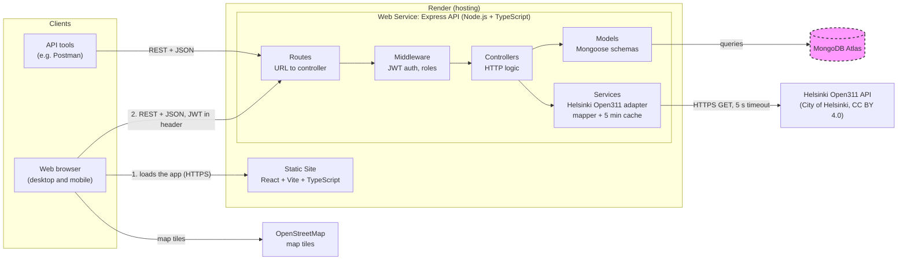

```mermaid
flowchart LR
    subgraph Clients["Clients"]
        Browser["Web browser<br/>(desktop and mobile)"]
        ApiTool["API tools<br/>(e.g. Postman)"]
    end

    subgraph Render["Render (hosting)"]
        Static["Static Site<br/>React + Vite + TypeScript"]

        subgraph Api["Web Service: Express API (Node.js + TypeScript)"]
            Routes["Routes<br/>URL to controller"]
            Middleware["Middleware<br/>JWT auth, roles"]
            Controllers["Controllers<br/>HTTP logic"]
            Models["Models<br/>Mongoose schemas"]
            Services["Services<br/>Helsinki Open311 adapter<br/>mapper + 5 min cache"]
            Routes --> Middleware --> Controllers
            Controllers --> Models
            Controllers --> Services
        end
    end

    Atlas[("MongoDB Atlas")]
    Helsinki["Helsinki Open311 API<br/>(City of Helsinki, CC BY 4.0)"]
    Tiles["OpenStreetMap<br/>map tiles"]

    Browser -->|"1. loads the app (HTTPS)"| Static
    Browser -->|"2. REST + JSON, JWT in header"| Routes
    ApiTool -->|"REST + JSON"| Routes
    Browser -->|"map tiles"| Tiles
    Models -->|"queries"| Atlas
    Services -->|"HTTPS GET, 5 s timeout"| Helsinki

    style Atlas fill:#f9f,stroke:#333,stroke-width:2px,stroke-dasharray: 5 5
```
